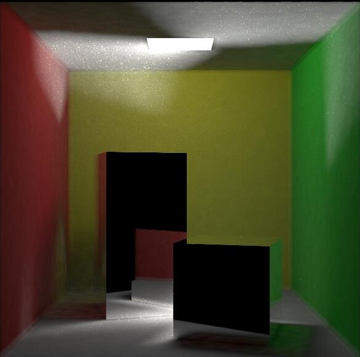
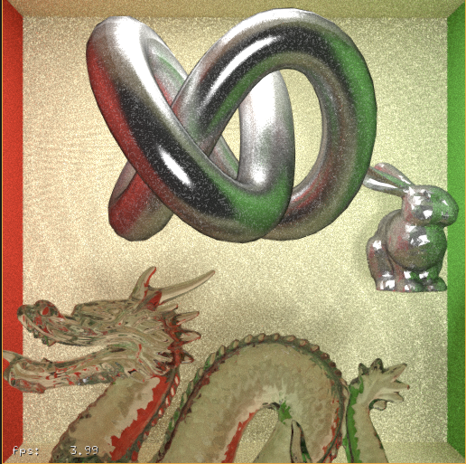
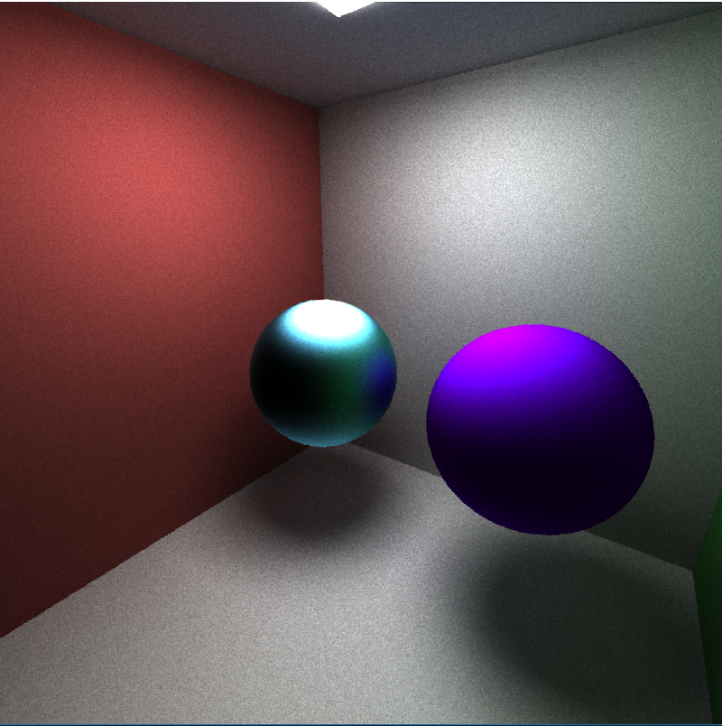
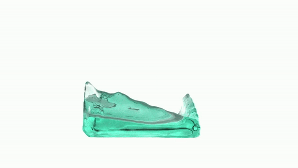
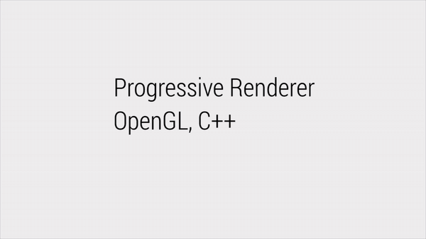
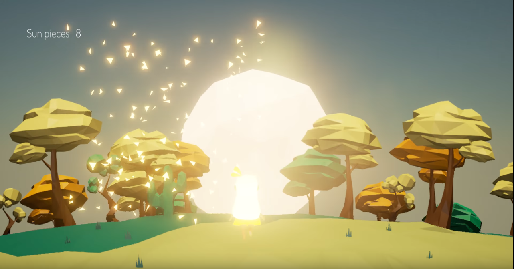

# Projects

| | | | | | | | | |
| :--------: | :---------: | :--------: | :---------: | :--------: | :---------: | :--------: | :---------: | :--------: |
|  |  |  |  |       | |  |  |  |
|  [Bidirectional Photon Mapper with Nvidia Optix](https://github.com/GPU-VCM/BDPM) | [Bidirectional Path tracer with Optix](https://github.com/GPU-VCM/BDPM/tree/dev-bdpt) | [Vulkan Boids](https://github.com/aksris/Project6-Vulkan-Flocking) |  [CUDA Rasterizer](https://github.com/aksris/Project4-CUDA-Rasterizer) |          [GPU Path tracer](https://github.com/aksris/Project3-CUDA-Path-Tracer)    |  [CUDA Boids](https://github.com/aksris/Project1-CUDA-Flocking) |  [FLIP/PIC C++ Fluid Simulation](https://github.com/aksris/thanda) |  [CPU Path Tracer](https://github.com/aksris/PathTracer) |  [CPU Progressive Renderer](https://github.com/aksris/PathTracer) |

# Game Dev

| | | |
| :---: | :---: | :---: |
|  |  |  |
| Apepi |  Caroll | Project Em |
